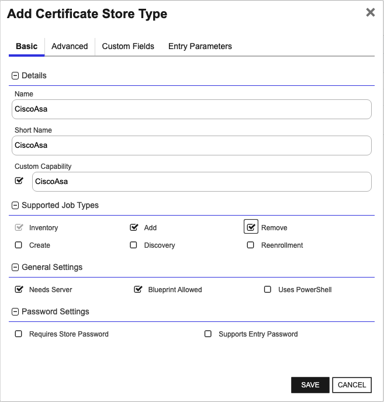
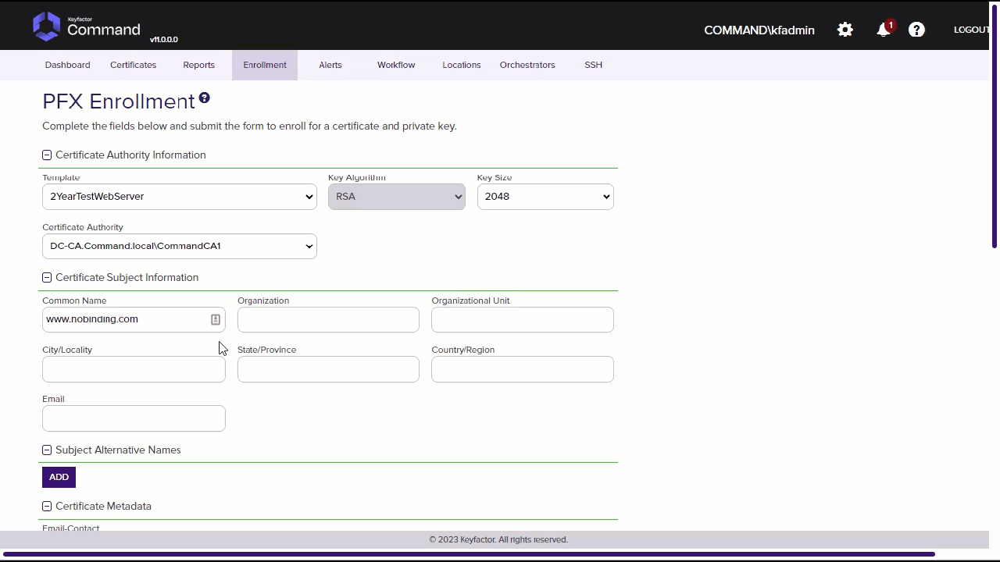
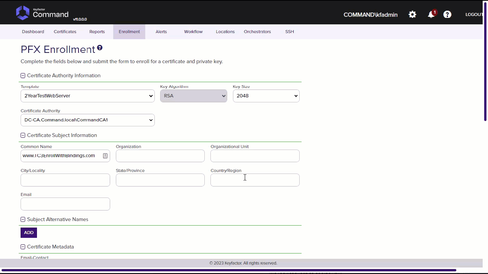
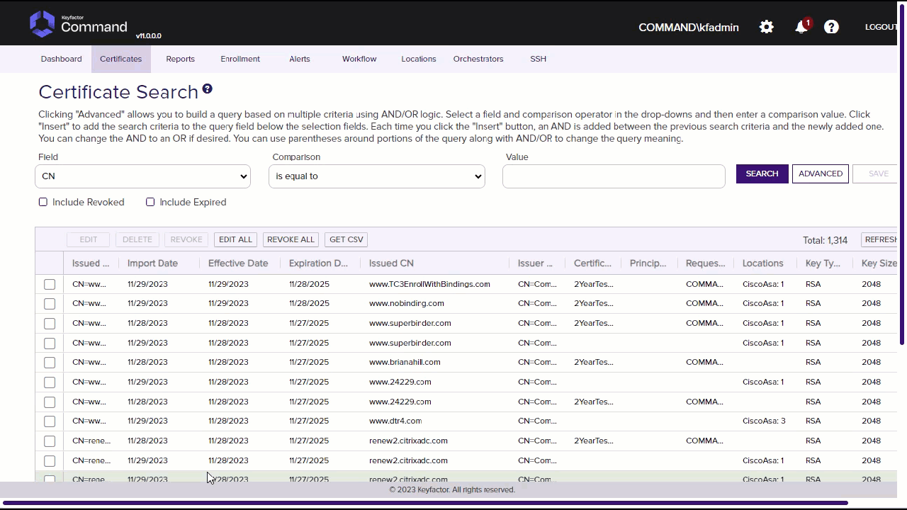
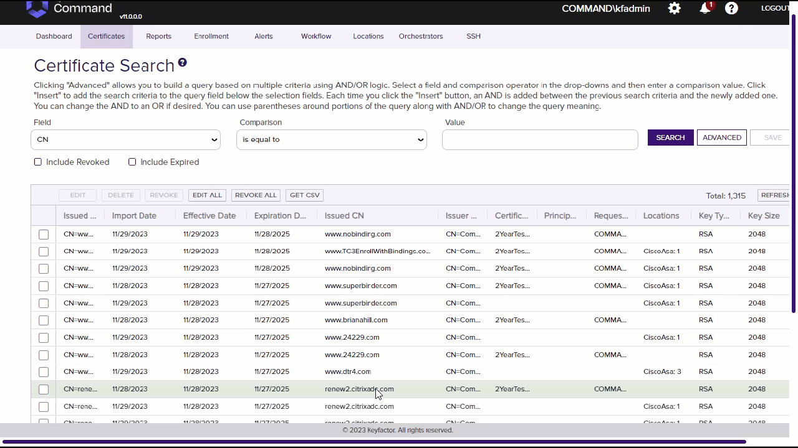
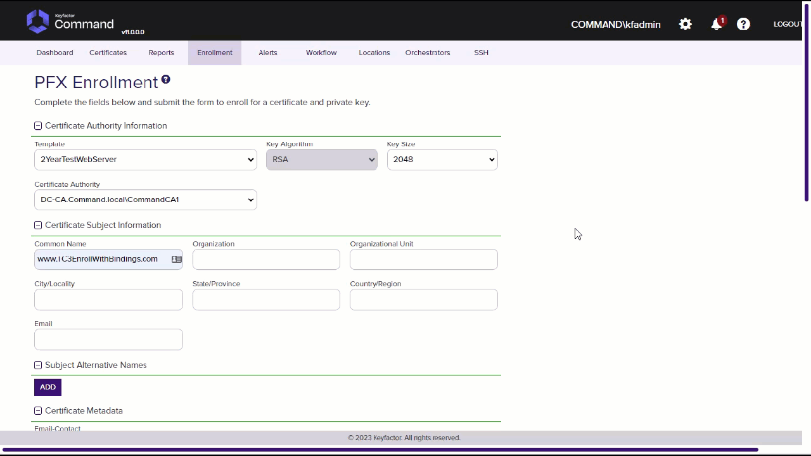
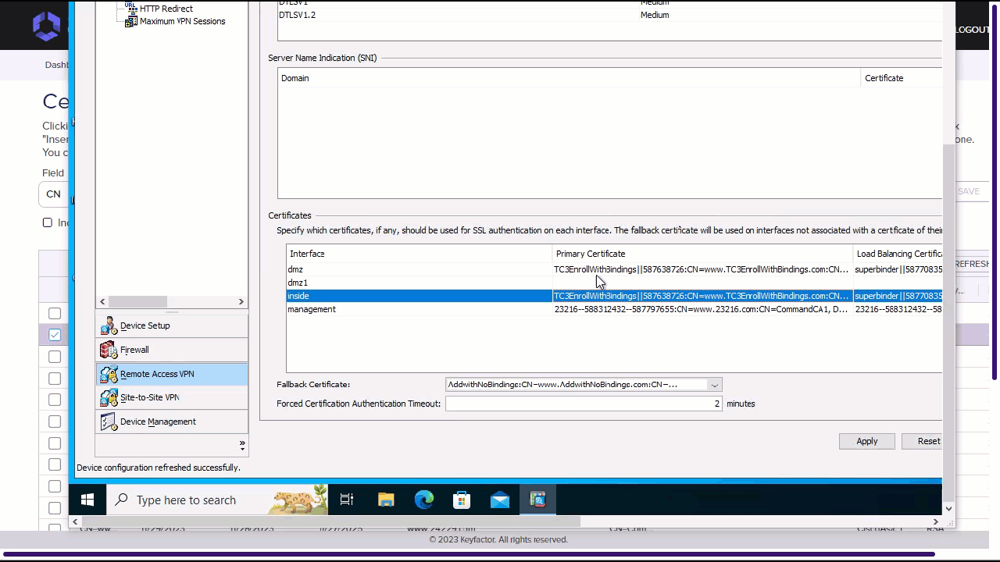
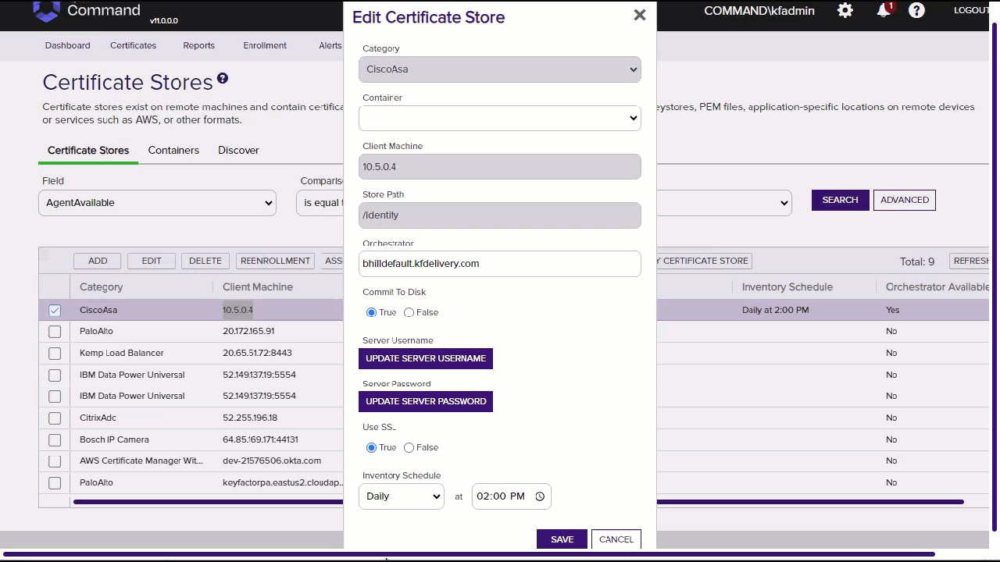

<h1 align="center" style="border-bottom: none">
    Cisco Asa Universal Orchestrator Extension
</h1>

<p align="center">
  <!-- Badges -->

<a href="https://github.com/Keyfactor/cisco-asa-orchestrator/releases"></a>


</p>

<p align="center">
  <!-- TOC -->
  <a href="#support">
    <b>Support</b>
  </a>
  ·
  <a href="#installation">
    <b>Installation</b>
  </a>
  ·
  <a href="#license">
    <b>License</b>
  </a>
  ·
  <a href="https://github.com/orgs/Keyfactor/repositories?q=orchestrator">
    <b>Related Integrations</b>
  </a>
</p>

## Overview

The Cisco Asa Orchestrator Manages Only Identity Certificates and TrustPoints on the Cisco Asa Device.  It manages bindings on the Remote Access VPN for those certificates.

**Note:** Some of the functionality uses the CLI through the API which returns command line strings.  This may be fragile especially inventory bindings if the CLI return changes between versions of the product.


## Compatibility

This integration is compatible with Keyfactor Universal Orchestrator version 10.2 and later.

## Support
The Cisco Asa Universal Orchestrator extension If you have a support issue, please open a support ticket by either contacting your Keyfactor representative or via the Keyfactor Support Portal at https://support.keyfactor.com. 
 
> To report a problem or suggest a new feature, use the **[Issues](../../issues)** tab. If you want to contribute actual bug fixes or proposed enhancements, use the **[Pull requests](../../pulls)** tab.

## Requirements & Prerequisites

Before installing the Cisco Asa Universal Orchestrator extension, we recommend that you install [kfutil](https://github.com/Keyfactor/kfutil). Kfutil is a command-line tool that simplifies the process of creating store types, installing extensions, and instantiating certificate stores in Keyfactor Command.


## CiscoAsa Certificate Store Type

To use the Cisco Asa Universal Orchestrator extension, you **must** create the CiscoAsa Certificate Store Type. This only needs to happen _once_ per Keyfactor Command instance.


### Supported Operations

| Operation    | Is Supported                                                                                                           |
|--------------|------------------------------------------------------------------------------------------------------------------------|
| Add          | ✅ Checked        |
| Remove       | ✅ Checked     |
| Discovery    | 🔲 Unchecked  |
| Reenrollment | 🔲 Unchecked |
| Create       | 🔲 Unchecked     |

### Creation Using kfutil:
`kfutil` is a custom CLI for the Keyfactor Command API and can be used to created certificate store types.
For more information on [kfutil](https://github.com/Keyfactor/kfutil) check out the [docs](https://github.com/Keyfactor/kfutil?tab=readme-ov-file#quickstart)

#### Using online definition from GitHub:
This will reach out to GitHub and pull the latest store-type definition
```shell
# CiscoAsa
kfutil store-types create CiscoAsa
```

#### Offline creation using integration-manifest file:
If required, it is possible to create store types from the [integration-manifest.json](./integration-manifest.json) included in this repo.
You would first download the [integration-manifest.json](./integration-manifest.json) and then run the following command
in your offline environment.
```shell
kfutil store-types create --from-file integration-manifest.json
```

### Manual Creation
If you do not wish to use the `kfutil` CLI then certificate store types can be creating in the web UI as described below.

* **Create CiscoAsa manually in the Command UI**:
    <details><summary>Create CiscoAsa manually in the Command UI</summary>

    Create a store type called `CiscoAsa` with the attributes in the tables below:

    #### Basic Tab
    | Attribute | Value | Description |
    | --------- | ----- | ----- |
    | Name | CiscoAsa | Display name for the store type (may be customized) |
    | Short Name | CiscoAsa | Short display name for the store type |
    | Capability | CiscoAsa | Store type name orchestrator will register with. Check the box to allow entry of value |
    | Supports Add | ✅ Checked | Check the box. Indicates that the Store Type supports Management Add |
    | Supports Remove | ✅ Checked | Check the box. Indicates that the Store Type supports Management Remove |
    | Supports Discovery | 🔲 Unchecked |  Indicates that the Store Type supports Discovery |
    | Supports Reenrollment | 🔲 Unchecked |  Indicates that the Store Type supports Reenrollment |
    | Supports Create | 🔲 Unchecked |  Indicates that the Store Type supports store creation |
    | Needs Server | ✅ Checked | Determines if a target server name is required when creating store |
    | Blueprint Allowed | ✅ Checked | Determines if store type may be included in an Orchestrator blueprint |
    | Uses PowerShell | 🔲 Unchecked | Determines if underlying implementation is PowerShell |
    | Requires Store Password | 🔲 Unchecked | Enables users to optionally specify a store password when defining a Certificate Store. |
    | Supports Entry Password | 🔲 Unchecked | Determines if an individual entry within a store can have a password. |

    The Basic tab should look like this:

    

    #### Advanced Tab
    | Attribute | Value | Description |
    | --------- | ----- | ----- |
    | Supports Custom Alias | Required | Determines if an individual entry within a store can have a custom Alias. |
    | Private Key Handling | Required | This determines if Keyfactor can send the private key associated with a certificate to the store. Required because IIS certificates without private keys would be invalid. |
    | PFX Password Style | Default | 'Default' - PFX password is randomly generated, 'Custom' - PFX password may be specified when the enrollment job is created (Requires the Allow Custom Password application setting to be enabled.) |

    The Advanced tab should look like this:

    

    > For Keyfactor **Command versions 24.4 and later**, a Certificate Format dropdown is available with PFX and PEM options. Ensure that **PFX** is selected, as this determines the format of new and renewed certificates sent to the Orchestrator during a Management job. Currently, all Keyfactor-supported Orchestrator extensions support only PFX.

    #### Custom Fields Tab
    Custom fields operate at the certificate store level and are used to control how the orchestrator connects to the remote target server containing the certificate store to be managed. The following custom fields should be added to the store type:

    | Name | Display Name | Description | Type | Default Value/Options | Required |
    | ---- | ------------ | ---- | --------------------- | -------- | ----------- |
    | CommitToDisk | Commit To Disk | This controls if you will write to the disk or memory on the device when adding or removing certificates. | Bool | false | ✅ Checked |
    | ServerUsername | Server Username | The username to log into the target server (This field is automatically created). Check the No Value Checkbox when using GMSA Accounts. | Secret |  | 🔲 Unchecked |
    | ServerPassword | Server Password | The password that matches the username to log into the target server (This field is automatically created). Check the No Value Checkbox when using GMSA Accounts. | Secret |  | 🔲 Unchecked |
    | ServerUseSsl | Use SSL | Determines whether the server uses SSL or not (This field is automatically created). | Bool | true | ✅ Checked |

    The Custom Fields tab should look like this:

    

    #### Entry Parameters Tab

    | Name | Display Name | Description | Type | Default Value | Entry has a private key | Adding an entry | Removing an entry | Reenrolling an entry |
    | ---- | ------------ | ---- | ------------- | ----------------------- | ---------------- | ----------------- | ------------------- | ----------- |
    | interfaces | Interfaces Comma Separated | Comma separated list of Interfaces to bind to. One can be the primary certificate and the other can be the load balancing certificate. For inside here is a sample of binding to both primary and load balancing inside,inside vpnlb-ip. | String |  | 🔲 Unchecked | 🔲 Unchecked | 🔲 Unchecked | 🔲 Unchecked |

    The Entry Parameters tab should look like this:

    


## Installation

1. **Download the latest Cisco Asa Universal Orchestrator extension from GitHub.** 

    Navigate to the [Cisco Asa Universal Orchestrator extension GitHub version page](https://github.com/Keyfactor/cisco-asa-orchestrator/releases/latest). Refer to the compatibility matrix below to determine whether the `net6.0` or `net8.0` asset should be downloaded. Then, click the corresponding asset to download the zip archive.

    | Universal Orchestrator Version | Latest .NET version installed on the Universal Orchestrator server | `rollForward` condition in `Orchestrator.runtimeconfig.json` | `cisco-asa-orchestrator` .NET version to download |
    | --------- | ----------- | ----------- | ----------- |
    | Older than `11.0.0` | | | `net6.0` |
    | Between `11.0.0` and `11.5.1` (inclusive) | `net6.0` | | `net6.0` | 
    | Between `11.0.0` and `11.5.1` (inclusive) | `net8.0` | `Disable` | `net6.0` | 
    | Between `11.0.0` and `11.5.1` (inclusive) | `net8.0` | `LatestMajor` | `net8.0` | 
    | `11.6` _and_ newer | `net8.0` | | `net8.0` |

    Unzip the archive containing extension assemblies to a known location.

    > **Note** If you don't see an asset with a corresponding .NET version, you should always assume that it was compiled for `net6.0`.

2. **Locate the Universal Orchestrator extensions directory.**

    * **Default on Windows** - `C:\Program Files\Keyfactor\Keyfactor Orchestrator\extensions`
    * **Default on Linux** - `/opt/keyfactor/orchestrator/extensions`
    
3. **Create a new directory for the Cisco Asa Universal Orchestrator extension inside the extensions directory.**
        
    Create a new directory called `cisco-asa-orchestrator`.
    > The directory name does not need to match any names used elsewhere; it just has to be unique within the extensions directory.

4. **Copy the contents of the downloaded and unzipped assemblies from __step 2__ to the `cisco-asa-orchestrator` directory.**

5. **Restart the Universal Orchestrator service.**

    Refer to [Starting/Restarting the Universal Orchestrator service](https://software.keyfactor.com/Core-OnPrem/Current/Content/InstallingAgents/NetCoreOrchestrator/StarttheService.htm).


6. **(optional) PAM Integration** 

    The Cisco Asa Universal Orchestrator extension is compatible with all supported Keyfactor PAM extensions to resolve PAM-eligible secrets. PAM extensions running on Universal Orchestrators enable secure retrieval of secrets from a connected PAM provider.

    To configure a PAM provider, [reference the Keyfactor Integration Catalog](https://keyfactor.github.io/integrations-catalog/content/pam) to select an extension, and follow the associated instructions to install it on the Universal Orchestrator (remote).


> The above installation steps can be supplemented by the [official Command documentation](https://software.keyfactor.com/Core-OnPrem/Current/Content/InstallingAgents/NetCoreOrchestrator/CustomExtensions.htm?Highlight=extensions).


## Defining Certificate Stores


### Store Creation

* **Manually with the Command UI**

    <details><summary>Create Certificate Stores manually in the UI</summary>

    1. **Navigate to the _Certificate Stores_ page in Keyfactor Command.**

        Log into Keyfactor Command, toggle the _Locations_ dropdown, and click _Certificate Stores_.

    2. **Add a Certificate Store.**

        Click the Add button to add a new Certificate Store. Use the table below to populate the **Attributes** in the **Add** form.

        | Attribute | Description |
        | --------- | ----------- |
        | Category | Select "CiscoAsa" or the customized certificate store name from the previous step. |
        | Container | Optional container to associate certificate store with. |
        | Client Machine | Hostname or IP of the Cisco Asa Device without the http:// or https:// prefix same sample would be 10.5.0.4. |
        | Store Path | Cisco Asa Certificate Types to manage for Now all that is supported is /Identity. |
        | Orchestrator | Select an approved orchestrator capable of managing `CiscoAsa` certificates. Specifically, one with the `CiscoAsa` capability. |
        | CommitToDisk | This controls if you will write to the disk or memory on the device when adding or removing certificates. |
        | ServerUsername | The username to log into the target server (This field is automatically created). Check the No Value Checkbox when using GMSA Accounts. |
        | ServerPassword | The password that matches the username to log into the target server (This field is automatically created). Check the No Value Checkbox when using GMSA Accounts. |
        | ServerUseSsl | Determines whether the server uses SSL or not (This field is automatically created). |
    </details>


* **Using kfutil**
    
    <details><summary>Create Certificate Stores with kfutil</summary>
    
    1. **Generate a CSV template for the CiscoAsa certificate store**

        ```shell
        kfutil stores import generate-template --store-type-name CiscoAsa --outpath CiscoAsa.csv
        ```
    2. **Populate the generated CSV file**

        Open the CSV file, and reference the table below to populate parameters for each **Attribute**.

        | Attribute | Description |
        | --------- | ----------- |
        | Category | Select "CiscoAsa" or the customized certificate store name from the previous step. |
        | Container | Optional container to associate certificate store with. |
        | Client Machine | Hostname or IP of the Cisco Asa Device without the http:// or https:// prefix same sample would be 10.5.0.4. |
        | Store Path | Cisco Asa Certificate Types to manage for Now all that is supported is /Identity. |
        | Orchestrator | Select an approved orchestrator capable of managing `CiscoAsa` certificates. Specifically, one with the `CiscoAsa` capability. |
        | CommitToDisk | This controls if you will write to the disk or memory on the device when adding or removing certificates. |
        | ServerUsername | The username to log into the target server (This field is automatically created). Check the No Value Checkbox when using GMSA Accounts. |
        | ServerPassword | The password that matches the username to log into the target server (This field is automatically created). Check the No Value Checkbox when using GMSA Accounts. |
        | ServerUseSsl | Determines whether the server uses SSL or not (This field is automatically created). |
    3. **Import the CSV file to create the certificate stores**

        ```shell
        kfutil stores import csv --store-type-name CiscoAsa --file CiscoAsa.csv
        ```

* **PAM Provider Eligible Fields**
    <details><summary>Attributes eligible for retrieval by a PAM Provider on the Universal Orchestrator</summary>

    If a PAM provider was installed _on the Universal Orchestrator_ in the [Installation](#Installation) section, the following parameters can be configured for retrieval _on the Universal Orchestrator_.

    | Attribute | Description |
    | --------- | ----------- |
    | ServerUsername | The username to log into the target server (This field is automatically created). Check the No Value Checkbox when using GMSA Accounts. |
    | ServerPassword | The password that matches the username to log into the target server (This field is automatically created). Check the No Value Checkbox when using GMSA Accounts. |

    Please refer to the **Universal Orchestrator (remote)** usage section ([PAM providers on the Keyfactor Integration Catalog](https://keyfactor.github.io/integrations-catalog/content/pam)) for your selected PAM provider for instructions on how to load attributes orchestrator-side.

    > Any secret can be rendered by a PAM provider _installed on the Keyfactor Command server_. The above parameters are specific to attributes that can be fetched by an installed PAM provider running on the Universal Orchestrator server itself.
    </details>


> The content in this section can be supplemented by the [official Command documentation](https://software.keyfactor.com/Core-OnPrem/Current/Content/ReferenceGuide/Certificate%20Stores.htm?Highlight=certificate%20store).


## Test Cases

<details>
<summary>Cisco Asa</summary>

Case Number|Case Name|Enrollment Params|Expected Results|Passed|Screenshot
----|------------------------|------------------------------------|--------------|----------------|-------------------------
1|Inventory|N/A|Identity certificates only will be inventoried on the the device and appear in the Cisco Asa Store in Keyfactor Command|True|
2|New Cert Enrollment To Identiy Certs with No Bindings|**Alias:** NoBindingCertTC2 **Interfaces Comma Separated:**|Cert will be Installed to Identity Certificates with Trustpoint name of NoBindingCertTC2|True|
3|New Cert Enrollment To Identiy Certs with Bindings|**Alias:** TC3EnrollWithBindings **Interfaces Comma Separated:** inside,dmz|Cert will be Installed to Identity Certificates with Trustpoint name of TC3EnrollWithBindings and bound to inside and dmz interfaces|True|
4|Renew Cert To Identiy Certs with No Bindings|**Alias:** NoBindingCertTC2 **Interfaces Comma Separated:**|Cert will Renewed to Identity Certificates with Trustpoint name of NoBindingCertTC2doublepipeSomeDateInt this is *not* a replace to prevent downtime.|True|
5|Renew Cert To Identiy Certs with Bindings|**Alias:** TC3EnrollWithBindings **Interfaces Comma Separated:** inside,dmz|Cert will Renewed to Identity Certificates with Trustpoint name of TC3EnrollWithBindingsdoublepipeSomeDateInt this is *not* a replace to prevent downtime.  It will also be bound to dmz and inside interfaces.|True|
6|Attempted Replace without overwrite flag To Identiy Certs with Bindings|**Alias:** TC3EnrollWithBindings **Interfaces Comma Separated:** inside,dmz|Job will fail and the result will indicate to use the overwrite flag|True|
7|Remove Cert With Bindings|**Alias:** TC3EnrollWithBindingsdoublepipe587638726 **Interfaces Comma Separated:** inside,dmz|Identity Certifite will be deleted and bindings removed.|True|
8|Commit To Disk Test|**Alias:** CommitToDiskTC **Interfaces Comma Separated:**|After Enrollment the startup config and running config in Cisco Asa Should be the same|True|
9|Attempted Replace with overwrite flag To Identiy Certs with Bindings|**Alias:** TC3EnrollWithBindings **Interfaces Comma Separated:** inside,dmz|Since overwrite flag was used, it will add and rebind a new certificate named TC3EnrollWithBindingsdoublepipeSomeDateInt this is *not* a replace to prevent downtime|True|

</details>


## License

Apache License 2.0, see [LICENSE](LICENSE).

## Related Integrations

See all [Keyfactor Universal Orchestrator extensions](https://github.com/orgs/Keyfactor/repositories?q=orchestrator).