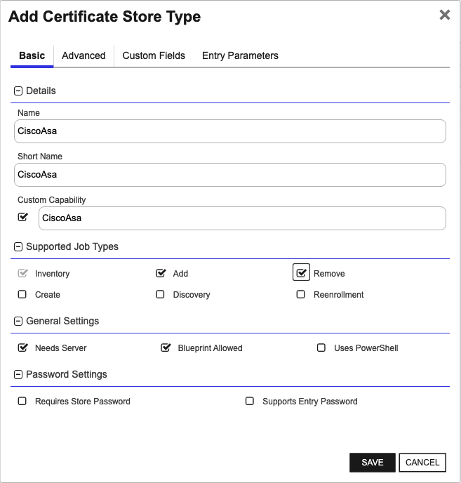
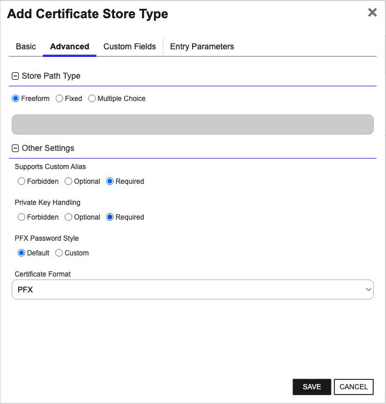
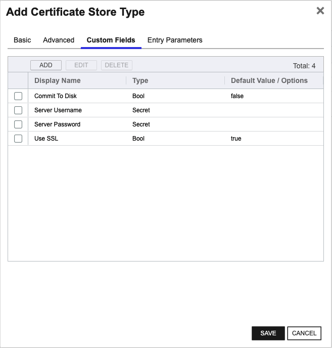

## CiscoAsa

The CiscoAsa Certificate Store Type in Keyfactor Command enables the management of Identity Certificates and TrustPoints on Cisco Asa devices. This store type represents a specific configuration for handling certificates on these devices, including managing and binding certificates to interfaces for Remote Access VPN.

Keyfactor Command's use of the CiscoAsa Certificate Store Type facilitates various operations, such as inventorying certificates, adding new certificates, and removing certificates from the configured store on the Cisco Asa device. This store type is designed to interact with the Cisco Asa API, occasionally using the CLI through the API, which returns command line strings. This interaction can be fragile if the CLI commands change between different versions of the Cisco Asa software.

There are a few noteworthy caveats and limitations to keep in mind. The store type requires a server username and password with privilege level 15 to access the Cisco Asa API. Additionally, it's important to decide whether the operation should write to device memory only or commit changes to disk, affecting the persistence of changes after reboots. While the extension handles various common operations, users should be aware of these considerations to avoid potential issues when managing certificates.


### Supported Job Types

| Job Name | Supported |
| -------- | --------- |
| Inventory | ✅ |
| Management Add | ✅ |
| Management Remove | ✅ |
| Discovery |  |
| Create |  |
| Reenrollment |  |

## Requirements

The configuration of the CiscoAsa Universal Orchestrator extension requires specific settings and considerations. Follow these steps to ensure proper setup and functionality:

1. **Configure the Remote Platform (Cisco Asa) and API Access**:
   - Ensure that the Cisco Asa device is accessible over the network and that the API is enabled.
   - Verify that the device is running a compatible version of the Cisco Asa software.

2. **Create a Service Account**:
   - Create an account on the Cisco Asa device with privilege level 15 access.
   - Note the username and password for this account, as they will be required when setting up the Certificate Store in Keyfactor Command.

3. **Install the Keyfactor Universal Orchestrator Extension for CiscoAsa**:
   - Deploy the Cisco Asa Universal Orchestrator extension on a server with access to both Keyfactor Command and the Cisco Asa device.

4. **Create the CiscoAsa Certificate Store Type**:
   - In Keyfactor Command, navigate to Certificate Store Types and create a new store type with the following basic and advanced settings:
     - **Name**: CiscoAsa
     - **Short Name**: CiscoAsa
     - **Supported Job Types**: Inventory, Add, Remove
     - **Needs Server**: Checked
     - **Blueprint Allowed**: Checked
     - **Store Path Type**: Freeform
     - **Supports Custom Alias**: Required
     - **Private Keys**: Required
     - **PFX Password Style**: Default or Custom

5. **Create the CiscoAsa Certificate Store**:
   - In Keyfactor Command, navigate to Certificate Stores and create a new store using the previously defined CiscoAsa Certificate Store Type.
   - Provide the following information during store creation:
     - **Category**: CiscoAsa
     - **Client Machine**: Hostname or IP of the Cisco Asa device
     - **Store Path**: /Identity
     - **Orchestrator**: Select the orchestrator with CiscoAsa capability
     - **Commit To Disk**: True or False based on your requirements
     - **Server Username**: The service account username
     - **Server Password**: The service account password
     - **Use SSL**: Determine whether to use SSL for API connection

By following these steps, you will ensure that the Cisco Asa device is properly configured for certificate management using the CiscoAsa Universal Orchestrator extension in Keyfactor Command.


## Certificate Store Type Configuration

The recommended method for creating the `CiscoAsa` Certificate Store Type is to use [kfutil](https://github.com/Keyfactor/kfutil). After installing, use the following command to create the `` Certificate Store Type:

```shell
kfutil store-types create CiscoAsa
```

<details><summary>CiscoAsa</summary>

Create a store type called `CiscoAsa` with the attributes in the tables below:

### Basic Tab
| Attribute | Value | Description |
| --------- | ----- | ----- |
| Name | CiscoAsa | Display name for the store type (may be customized) |
| Short Name | CiscoAsa | Short display name for the store type |
| Capability | CiscoAsa | Store type name orchestrator will register with. Check the box to allow entry of value |
| Supported Job Types (check the box for each) | Add, Discovery, Remove | Job types the extension supports |
| Supports Add | ✅ | Check the box. Indicates that the Store Type supports Management Add |
| Supports Remove | ✅ | Check the box. Indicates that the Store Type supports Management Remove |
| Supports Discovery |  |  Indicates that the Store Type supports Discovery |
| Supports Reenrollment |  |  Indicates that the Store Type supports Reenrollment |
| Supports Create |  |  Indicates that the Store Type supports store creation |
| Needs Server | ✅ | Determines if a target server name is required when creating store |
| Blueprint Allowed | ✅ | Determines if store type may be included in an Orchestrator blueprint |
| Uses PowerShell |  | Determines if underlying implementation is PowerShell |
| Requires Store Password |  | Determines if a store password is required when configuring an individual store. |
| Supports Entry Password |  | Determines if an individual entry within a store can have a password. |

The Basic tab should look like this:



### Advanced Tab
| Attribute | Value | Description |
| --------- | ----- | ----- |
| Supports Custom Alias | Required | Determines if an individual entry within a store can have a custom Alias. |
| Private Key Handling | Required | This determines if Keyfactor can send the private key associated with a certificate to the store. Required because IIS certificates without private keys would be invalid. |
| PFX Password Style | Default | 'Default' - PFX password is randomly generated, 'Custom' - PFX password may be specified when the enrollment job is created (Requires the Allow Custom Password application setting to be enabled.) |

The Advanced tab should look like this:



### Custom Fields Tab
Custom fields operate at the certificate store level and are used to control how the orchestrator connects to the remote target server containing the certificate store to be managed. The following custom fields should be added to the store type:

| Name | Display Name | Type | Default Value/Options | Required | Description |
| ---- | ------------ | ---- | --------------------- | -------- | ----------- |


The Custom Fields tab should look like this:




</details>

## Certificate Store Configuration

After creating the `CiscoAsa` Certificate Store Type and installing the Cisco Asa Universal Orchestrator extension, you can create new [Certificate Stores](https://software.keyfactor.com/Core-OnPrem/Current/Content/ReferenceGuide/Certificate%20Stores.htm?Highlight=certificate%20store) to manage certificates in the remote platform.

The following table describes the required and optional fields for the `CiscoAsa` certificate store type.

| Attribute | Description | Attribute is PAM Eligible |
| --------- | ----------- | ------------------------- |
| Category | Select "CiscoAsa" or the customized certificate store name from the previous step. | |
| Container | Optional container to associate certificate store with. | |
| Client Machine | Hostname or IP address of the Cisco Asa Device without the http:// or https:// prefix. Example: 10.5.0.4. | |
| Store Path | Cisco Asa Certificate Types to manage, currently only supporting '/Identity'. | |
| Orchestrator | Select an approved orchestrator capable of managing `CiscoAsa` certificates. Specifically, one with the `CiscoAsa` capability. | |

* **Using kfutil**

    ```shell
    # Generate a CSV template for the AzureApp certificate store
    kfutil stores import generate-template --store-type-name CiscoAsa --outpath CiscoAsa.csv

    # Open the CSV file and fill in the required fields for each certificate store.

    # Import the CSV file to create the certificate stores
    kfutil stores import csv --store-type-name CiscoAsa --file CiscoAsa.csv
    ```

* **Manually with the Command UI**: In Keyfactor Command, navigate to Certificate Stores from the Locations Menu. Click the Add button to create a new Certificate Store using the attributes in the table above.