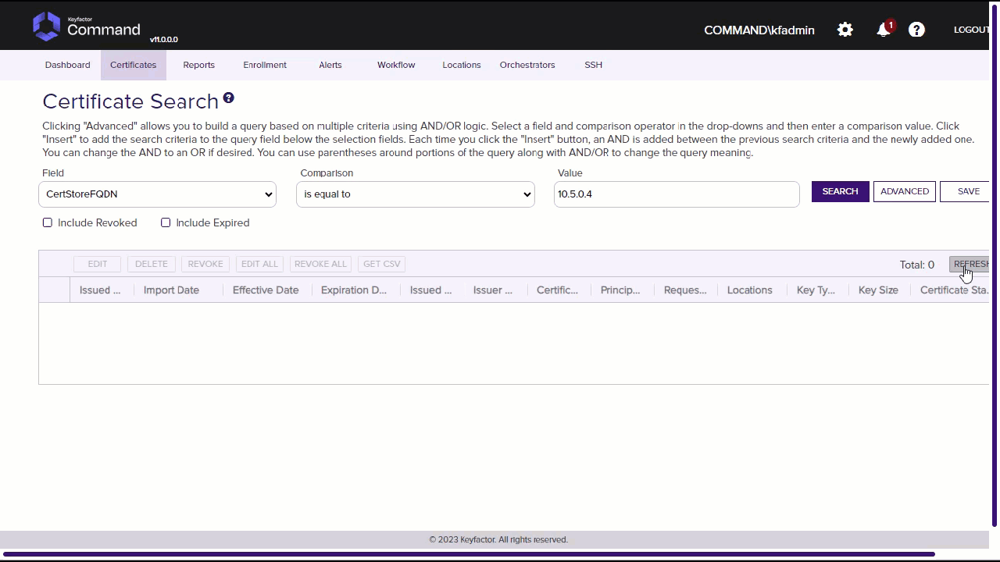
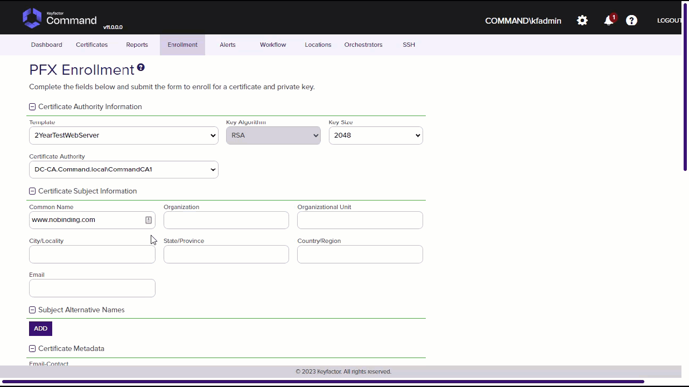
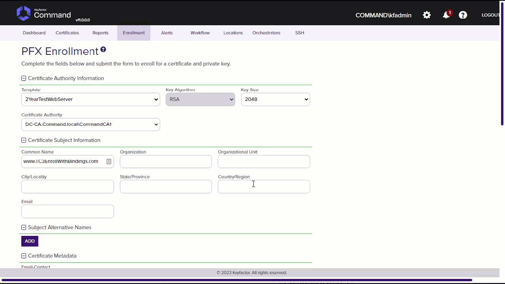
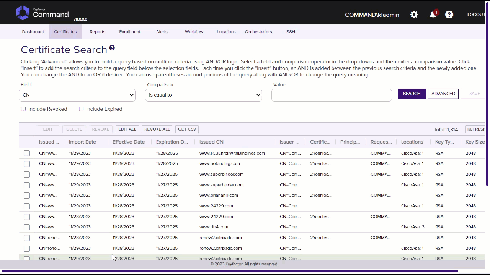
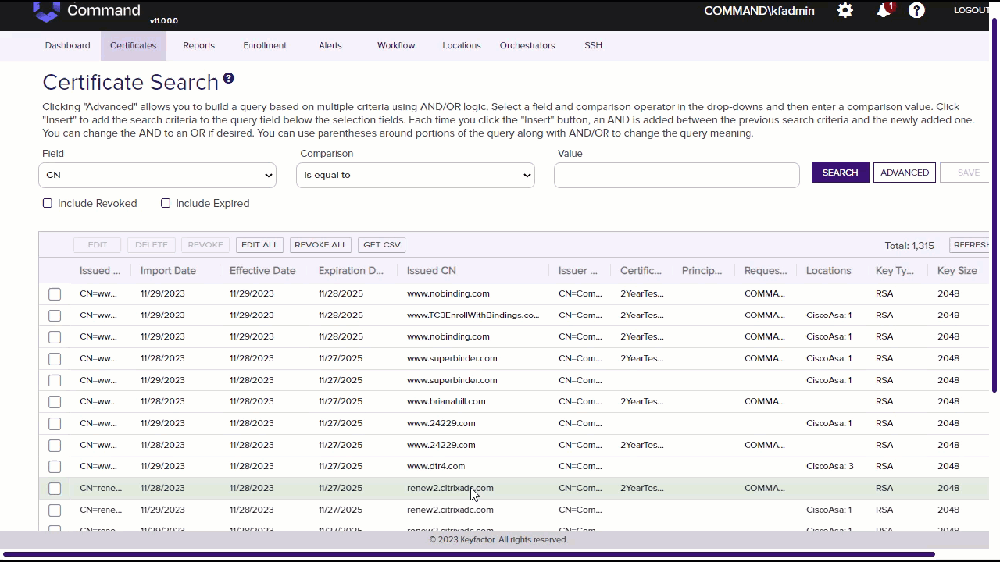
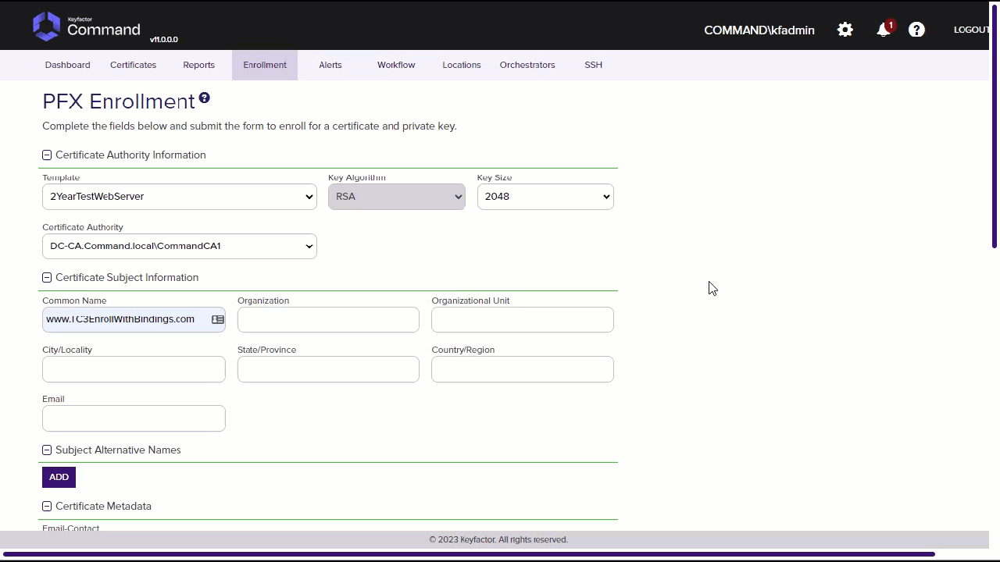
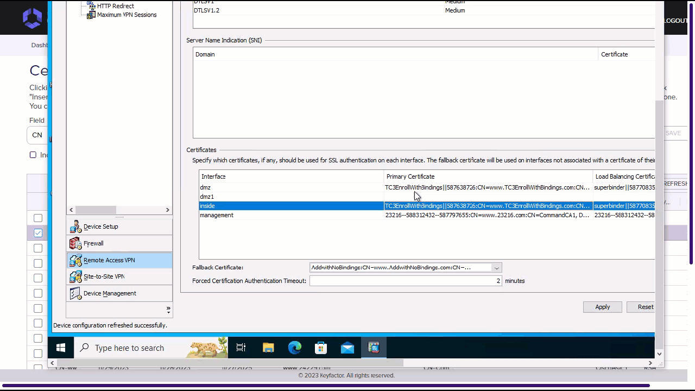
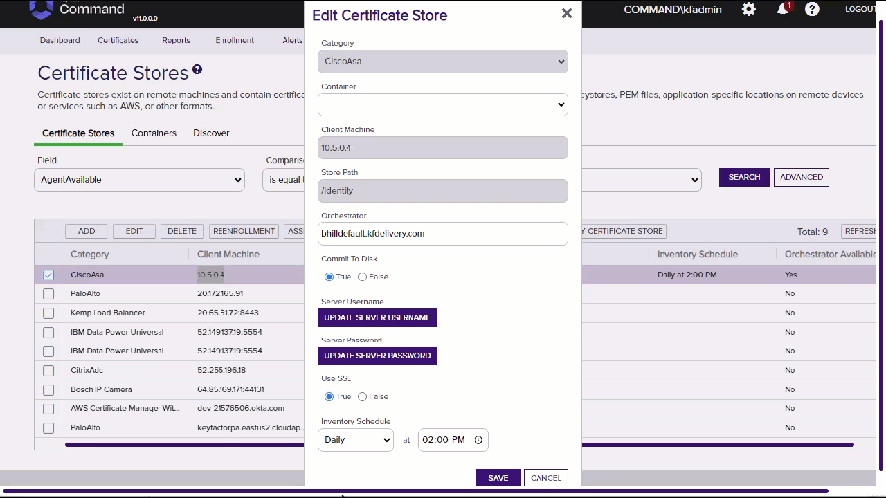

# Cisco Asa Orchestrator Configuration
## Overview

The Cisco Asa Orchestrator Manages Only Identity Certificates and TrustPoints on the Cisco Asa Device.  It manages bindings on the Remote Access VPN for those certificates.

**Note:** Some of the functionality uses the CLI through the API which returns command line strings.  This may be fragile especially inventory bindings if the CLI return changes between versions of the product.

## Creating New Certificate Store Type

Cisco Asa Certificate Store Type

**In Keyfactor Command create a new Certificate Store Type as specified below:**

**Basic Settings:**

CONFIG ELEMENT | VALUE | DESCRIPTION
--|--|--
Name | Cisco Asa| Display name for the store type (may be customized)
Short Name| CiscoAsa | Short display name for the store type
Custom Capability | Leave Unchecked | Store type name orchestrator will register with. Check the box to allow entry of value
Supported Job Types | Inventory, Add, Remove | Job types the extension supports
Needs Server | Checked | Determines if a target server name is required when creating store
Blueprint Allowed | Checked | Determines if store type may be included in an Orchestrator blueprint
Uses PowerShell | Unchecked | Determines if underlying implementation is PowerShell
Requires Store Password| Unchecked | Determines if a store password is required when configuring an individual store.
Supports Entry Password| Unchecked | Determines if an individual entry within a store can have a password.

**Advanced Settings:**

CONFIG ELEMENT | VALUE | DESCRIPTION
--|--|--
Store Path Type| Freeform | Determines what restrictions are applied to the store path field when configuring a new store.
Store Path Value | N/A | N/A for Freeform.
Supports Custom Alias | Required | Determines if an individual entry within a store can have a custom Alias.
Private Keys | Required | This determines if Keyfactor can send the private key associated with a certificate to the store. Cisco Asa requires private keys.
PFX Password Style | Default or Custom | "Default" - PFX password is randomly generated, "Custom" - PFX password may be specified when the enrollment job is created (Requires the *Allow Custom Password* application setting to be enabled.)

**Custom Fields:**

Custom fields operate at the certificate store level and are used to control how the orchestrator connects to the remote
target server containing the certificate store to be managed

Name|Display Name|Type|Default Value / Options|Required|Description
---|---|---|---|---|---
CommitToDisk|Commit To Disk|bool| False |Yes|This controls if you will write to the disk or memory on the device when adding or removing certificates.
spnwithport|SPN With Port|Bool|false|No|Internally set the -IncludePortInSPN option when creating the remote PowerShell connection. Needed for some Kerberos configurations.
ServerUsername|Server Username|Secret||No|The username to log into the target server (This field is automatically created).   Check the No Value Checkbox when using GMSA Accounts.
ServerPassword|Server Password|Secret||No|The password that matches the username to log into the target server (This field is automatically created).  Check the No Value Checkbox when using GMSA Accounts.
ServerUseSsl|Use SSL|Bool|true|Yes|Determine whether the server uses SSL or not (This field is automatically created)

**Entry Parameters:**

Entry parameters are inventoried and maintained for each entry within a certificate store.
They are typically used to support binding of a certificate to a resource.

Name|Display Name| Type|Default Value|Required When|Description
---|---|---|---|---|---
interfaces | Interfaces Comma Separated|String| |All Unchecked| Comma separated list of Interfaces to bind to.  One can be the primary certificate and the other can be the load balancing certificate.  For inside here is a sample of binding to both primary and load balancing inside,inside vpnlb-ip.

None of the above entry parameters have the "Depends On" field set.

Click Save to save the Certificate Store Type.

## Creating New Certificate Stores
Once the Certificate Store Types have been created, you need to create the Certificate Stores prior to using the extension.
Here are the settings required for each Store Type previously configured.

Cisco Asa Certificate Store

In Keyfactor Command, navigate to Certificate Stores from the Locations Menu.  Click the Add button to create a new Certificate Store using the settings defined below.

#### STORE CONFIGURATION 
CONFIG ELEMENT|DESCRIPTION
----------------|---------------
Category | Select Cisco Asa or the customized certificate store display name from above.
Container | Optional container to associate certificate store with.
Client Machine | Hostname or IP of the Cisco Asa Device without the http:// or https:// prefix same sample would be 10.5.0.4.
Store Path | Cisco Asa Certificate Types to manage for Now all that is supported is /Identity. 
Orchestrator | Select an approved orchestrator capable of managing Cisco Asa Certificates (one that has declared the CiscoAsa capability)
Commit To Disk | False to write to device memory only (running config will be gone after a reboot) or true to write to disk (startup config in Cisco Asa)
Server Username | Account to use when accessing the Cisco Asa Api Needs privilege level 15.
Server Password | Password to use when accessing the Cisco Asa Api.
Use SSL | Connect to the Cisco Asa Api using SSL.
Inventory Schedule | The interval that the system will use to report on what certificates are currently in the store. 

Click Save to save the settings for this Certificate Store

## Test Cases

Cisco Asa

Case Number|Case Name|Enrollment Params|Expected Results|Passed|Screenshot
----|------------------------|------------------------------------|--------------|----------------|-------------------------
1|Inventory|N/A|Identity certificates only will be inventoried on the the device and appear in the Cisco Asa Store in Keyfactor Command|True|
2|New Cert Enrollment To Identiy Certs with No Bindings|**Alias:** NoBindingCertTC2 **Interfaces Comma Separated:**|Cert will be Installed to Identity Certificates with Trustpoint name of NoBindingCertTC2|True|
3|New Cert Enrollment To Identiy Certs with Bindings|**Alias:** TC3EnrollWithBindings **Interfaces Comma Separated:** inside,dmz|Cert will be Installed to Identity Certificates with Trustpoint name of TC3EnrollWithBindings and bound to inside and dmz interfaces|True|
4|Renew Cert To Identiy Certs with No Bindings|**Alias:** NoBindingCertTC2 **Interfaces Comma Separated:**|Cert will Renewed to Identity Certificates with Trustpoint name of NoBindingCertTC2||SomeDateInt this is *not* a replace to prevent downtime.|True|
5|Renew Cert To Identiy Certs with Bindings|**Alias:** TC3EnrollWithBindings **Interfaces Comma Separated:** inside,dmz|Cert will Renewed to Identity Certificates with Trustpoint name of TC3EnrollWithBindings||SomeDateInt this is *not* a replace to prevent downtime.  It will also be bound to dmz and inside interfaces.|True|
6|Attempted Replace without overwrite flag To Identiy Certs with Bindings|**Alias:** TC3EnrollWithBindings **Interfaces Comma Separated:** inside,dmz|Job will fail and the result will indicate to use the overwrite flag|True|
7|Remove Cert With Bindings|**Alias:** TC3EnrollWithBindings||587638726 **Interfaces Comma Separated:** inside,dmz|Identity Certifite will be deleted and bindings removed.|True|
8|Commit To Disk Test|**Alias:** CommitToDiskTC **Interfaces Comma Separated:**|After Enrollment the startup config and running config in Cisco Asa Should be the same|True|
9|Attempted Replace with overwrite flag To Identiy Certs with Bindings|**Alias:** TC3EnrollWithBindings **Interfaces Comma Separated:** inside,dmz|Since overwrite flag was used, it will add and rebind a new certificate named TC3EnrollWithBindings||SomeDateInt this is *not* a replace to prevent downtime|True|

